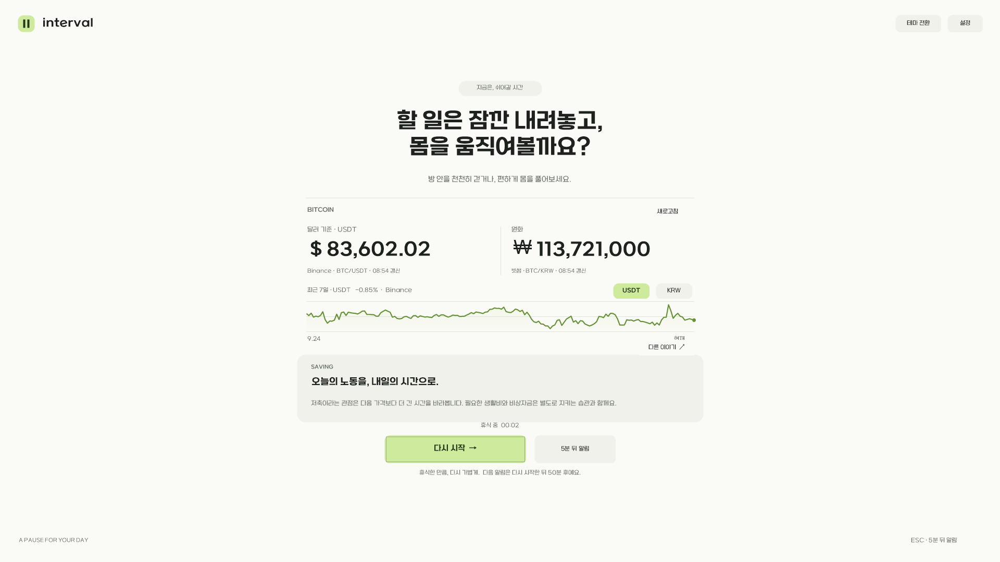
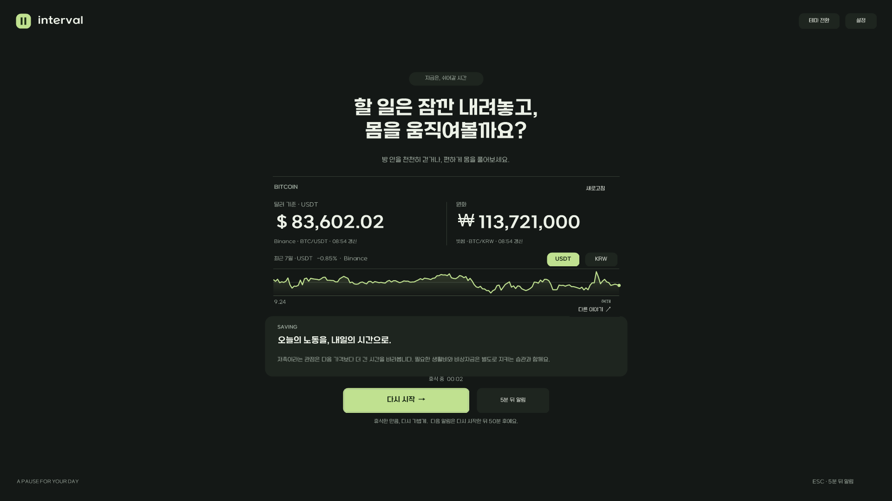

# 인터벌 · Interval for Windows

인터벌은 Windows 트레이에 상주하면서 정해진 시간마다 전체 화면으로 휴식과 가벼운 운동을 권하는 앱입니다. 기본 알림 간격은 50분이며, 휴식 후 **다시 시작**을 누른 시점부터 다음 간격을 셉니다.

C++17과 Windows 기본 API로 만들었습니다. Electron이나 웹뷰를 사용하지 않으며, 별도의 .NET 런타임이나 Visual C++ Redistributable 설치 없이 실행할 수 있습니다.

[다운로드](https://github.com/my3rdstory/interval-for-win/releases) · [오류 제보](https://github.com/my3rdstory/interval-for-win/issues) · [MIT 라이선스](LICENSE)

## 주요 기능

- 기본 50분 간격의 전체 화면 휴식 알림과 1~240분 간격 설정
- 휴식 후 타이머 다시 시작, 5분 뒤 알림, 일시 정지
- 트레이 상주와 Windows 로그인 시 자동 실행 옵션
- 작업표시줄 숫자 아이콘으로 남은 분 표시, 마지막 5분 강조, 표시 시점 선택
- 시스템 설정에 따른 화면 모드, 라이트 모드, 다크 모드
- 여러 모니터에 전체 화면 알림 표시
- 샌드박스 어그로체를 적용한 화면과 랜덤 휴식 문구
- 비트코인 USDT·원화 가격, 거래소 자동 전환, 최근 7일 선 그래프
- 비트코인의 기술·문화·밈·태도와 사운드 머니·저축 관점의 랜덤 글

### 화면

라이트 모드:



다크 모드:



스크린샷의 가격은 촬영 당시의 데이터입니다.

## 설치와 실행

### 실행 파일로 사용하기

1. [Releases](https://github.com/my3rdstory/interval-for-win/releases)에 실행 파일이 공개되면 `Interval-1.0.0-win-x64.zip`을 내려받습니다.
2. 원하는 폴더에 압축을 풉니다. ZIP에 포함된 라이선스와 고지 파일도 함께 보관합니다.
3. `Interval.exe`를 실행합니다. 설정 창이 열리고 기본 50분 타이머가 시작됩니다.

아직 릴리스 파일이 없다면 아래 빌드 방법으로 실행 파일을 만들 수 있습니다. 설치 프로그램과 관리자 권한은 필요하지 않습니다. Windows 10/11의 64비트 환경을 대상으로 합니다.

설정 창을 닫거나 **접고 계속 실행**을 누르면 타이머는 계속 실행됩니다. 기본 설정에서는 창이 최소화되고 작업표시줄에 남은 시간을 표시합니다. 트레이 메뉴도 계속 사용할 수 있으며, 트레이 아이콘이 보이지 않으면 작업표시줄의 숨겨진 아이콘 목록을 확인하세요.

### 작업표시줄 타이머

트레이 아이콘이 숨겨져 있어도 작업표시줄에서 다음 휴식까지 남은 시간을 확인할 수 있습니다.

- 아이콘의 숫자는 남은 분입니다. 4분 30초가 남았다면 `5`로 표시합니다.
- 창 제목에는 초 단위의 남은 시간을 표시합니다. 작업표시줄이 아이콘만 표시하는 설정이라면 숫자 아이콘으로 확인하세요.
- 마지막 5분에는 아이콘을 노란색으로 강조하고 제목에 **곧 휴식**을 표시합니다. 진행 표시줄은 간격이 지날수록 채워집니다.
- 일시 정지 시 아이콘은 `Ⅱ`, 휴식 중에는 `쉼`으로 바뀝니다.
- 작업표시줄 버튼을 클릭하면 최소화된 설정 창을 열 수 있습니다.

설정의 **작업표시줄 타이머** 버튼을 누르면 아래 세 가지 모드가 순서대로 바뀝니다.

| 모드 | 동작 |
| --- | --- |
| 항상 표시 | 기본값. 설정 창을 접어도 작업표시줄에 타이머 유지 |
| 5분 전부터 표시 | 평소에는 트레이에만 상주하고, 남은 시간이 5분 이내가 되면 작업표시줄 버튼만 표시. 창을 열거나 포커스를 이동하지 않음 |
| 표시 안 함 | 설정 창을 접으면 작업표시줄 버튼도 숨김. 트레이와 전체 화면 휴식 알림은 유지 |

표시 시점 설정은 앱을 다시 실행해도 유지합니다. 설정 창을 직접 열었을 때는 선택한 모드와 관계없이 작업표시줄 버튼이 표시됩니다. 작업표시줄 자체가 자동 숨김 상태라면 Windows 설정에 따라 숨겨집니다.

### 기본 조작

| 조작 | 동작 |
| --- | --- |
| 휴식 화면의 **다시 시작** | 화면을 닫고 설정한 간격을 새로 계산 |
| **5분 뒤 알림** 또는 휴식 화면에서 `Esc` | 화면을 닫고 5분 뒤 다시 알림 |
| 트레이 아이콘 클릭 | 설정 창 열기 |
| 트레이 아이콘 우클릭 | 지금 휴식, 타이머 재시작, 일시 정지, 설정, 종료 메뉴 |
| 설정 창 닫기 또는 `Esc` | 창을 접고, 선택한 작업표시줄 표시 방식에 따라 계속 실행 |
| 트레이 메뉴의 **인터벌 종료** | 앱 완전 종료 |

휴식 화면은 **다시 시작**이나 **5분 뒤 알림**을 선택할 때까지 유지됩니다. `Tab`과 `Enter`로 버튼을 조작할 수 있습니다. `Alt+F4`는 휴식 화면에서는 다시 시작, 설정 창에서는 창을 접고 계속 실행하는 동작입니다.

**Windows 시작 시 실행**은 기본으로 꺼져 있습니다. 설정에서 켜면 다음 로그인부터 설정 창을 열지 않고 시작하며, 선택한 작업표시줄 표시 방식을 적용합니다. 실행 파일을 다른 폴더로 옮길 때는 기존 위치에서 자동 실행을 끈 뒤, 새 위치에서 다시 켜주세요.

### 잠금·절전·재실행

잠금과 절전 중에는 타이머를 보류하고, 복귀하면 남은 시간을 이어갑니다. 휴식 화면이 열린 상태에서 잠금이나 절전에 들어갔다면 복귀 후 새 알림 간격으로 시작합니다. 앱을 종료했다가 다시 실행한 경우에도 새 간격으로 시작합니다.

### 제거

설정에서 **Windows 시작 시 실행**을 끄고, 트레이 메뉴로 앱을 종료한 뒤 압축을 풀었던 폴더를 삭제합니다. 설정은 `HKEY_CURRENT_USER\Software\Interval`에 남으므로 다시 설치할 때 재사용할 수 있습니다.

## 비트코인 가격과 차트

가격과 차트는 각각 다음 우선순위로 가져옵니다. 첫 번째 거래소가 응답하지 않거나 데이터가 잘못되면 두 번째 거래소를 사용합니다.

| 항목 | 1순위 | 2순위 |
| --- | --- | --- |
| 달러 기준 가격·차트 | Binance `BTCUSDT` | OKX `BTC-USDT` |
| 원화 가격·차트 | 빗썸 `KRW-BTC` | 업비트 `KRW-BTC` |

해외 가격은 **USDT 기준 시세**입니다. 정확한 USD 현물 환산 가격이 아니며, 화면에서도 USDT를 표시합니다. Binance는 공식 안내의 공개 시세 전용 호스트인 `data-api.binance.vision`을 사용합니다.

선 그래프는 최근 7일의 시간별 종가를 표시합니다. `USDT`와 `KRW` 버튼으로 통화를 전환할 수 있고, 가격과 차트의 거래소 출처는 각각 표시됩니다.

- 가격: 휴식 화면을 열 때, 화면이 열린 동안 60초마다 갱신
- 차트: 휴식 화면을 열 때 필요에 따라 갱신하고, 이후 10분 간격으로 갱신
- **새로고침**: 가격과 차트를 즉시 요청
- 두 거래소 모두 실패한 경우: 마지막으로 받은 값을 유지하고 갱신 실패 표시
- 이전 데이터도 없는 경우: 연결 실패 상태 표시

이전 가격과 차트는 앱이 실행되는 동안 메모리에만 보관합니다. 오프라인에서도 휴식 알림과 랜덤 글은 동작합니다. 시장동향 글은 수신한 차트의 변화율을 바탕으로 표시하며, 별도의 뉴스 수집 기능은 없습니다.

거래소 계정이나 API 키는 필요하지 않습니다. 앱은 주문, 거래, 지갑 기능을 제공하지 않습니다.

## 기술 구성

| 구성 | 역할 |
| --- | --- |
| C++17 / MSVC | 앱과 테스트 빌드 |
| Win32 API | 창, 전체 화면 알림, 트레이, 타이머, 설정 저장 |
| Windows Shell / COM | 작업표시줄 남은 시간 아이콘과 진행 상태 표시 |
| GDI+ / GDI | 화면·선 그래프 그리기, 임베딩 폰트와 입력란 표시 |
| WinHTTP | HTTPS 공개 시세 요청 |
| Windows 세션·전원 API | 잠금과 절전 시 타이머 보류 |
| PowerShell | 폰트 준비, 빌드, 배포 ZIP 생성, 화면 검증 |

별도의 GUI 프레임워크나 외부 차트·JSON 라이브러리는 사용하지 않습니다. JSON 파서는 프로젝트 소스에 포함되어 있습니다. C/C++ 런타임은 `/MT` 옵션으로 정적으로 링크합니다.

트레이 상주 중에는 시세를 주기적으로 요청하지 않습니다. 전체 화면 픽셀 버퍼는 그릴 때만 만들고 해제합니다. 이 개발 환경에서 실제 시세·화면 검증 후 측정한 작업 집합은 약 31~37MiB, 프로세스 전용 메모리는 약 8~9MiB였습니다. 메모리 사용량은 Windows 환경과 화면 해상도, 실행 이력에 따라 달라집니다.

### 폴더 구조

```text
interval-for-win/
├─ src/
│  ├─ main.cpp                 # 창, 트레이, 타이머, 화면, 시세 요청
│  ├─ core.hpp                 # 스케줄과 거래소 응답 처리
│  ├─ json.hpp                 # JSON 파서
│  ├─ content.hpp              # 휴식 문구와 비트코인 글
│  ├─ interval.rc              # 폰트 리소스와 버전 정보
│  └─ interval.manifest        # 실행 권한과 DPI 설정
├─ assets/
│  ├─ interval.svg             # 앱 기본 아이콘 원본
│  ├─ SB_Aggro_Font_license.pdf # 폰트 라이선스 원문
│  └─ licenses/                # Microsoft STL 라이선스 원문
├─ docs/screenshots/           # 실제 앱 화면
├─ tests/
│  ├─ core-tests.cpp           # 핵심 동작 검증
│  ├─ gui-smoke.ps1            # Windows 창·시세·화면 검증
│  ├─ taskbar-smoke.ps1        # 작업표시줄 표시 시점·상태·포커스 검증
│  └─ icon-smoke.ps1           # 다중 해상도 ICO와 실행 파일 아이콘 검증
├─ fetch-fonts.ps1             # 공식 폰트 다운로드와 해시 검증
├─ build-icon.ps1              # SVG 원본에서 Windows ICO 생성
├─ build.ps1                   # 빌드, 테스트, 배포 파일 생성
├─ LICENSE                    # 프로젝트의 MIT 라이선스
└─ THIRD-PARTY-NOTICES.md      # 폰트·Microsoft 구성 요소·API 고지
```

`build/`와 `dist/`는 로컬에서 생성하며 Git에 포함하지 않습니다. TTF 폰트 원본도 Git에 포함하지 않고 빌드 전에 공식 배포처에서 내려받습니다.

앱 기본 아이콘은 [SVG 원본](assets/interval.svg)으로 관리합니다. 빌드 시 Windows 기본 그리기 기능으로 16~256px의 다중 해상도 ICO를 생성해 실행 파일에 포함합니다. 작업관리자·파일 탐색기·트레이에서는 앱 기본 아이콘을 사용하고, 실행 중인 작업표시줄 버튼에는 남은 시간 숫자를 표시합니다. SVG 원본과 아이콘 빌드 코드는 프로젝트의 MIT 라이선스를 따릅니다.

## 소스 빌드

### 필요한 도구

- Windows 10/11 x64
- Git
- Windows PowerShell 5.1
- Visual Studio 2022 또는 Visual Studio 2022 Build Tools
  - **C++를 사용한 데스크톱 개발** 워크로드
  - MSVC x64/x86 빌드 도구와 Windows SDK
- 첫 폰트 다운로드에 필요한 인터넷 연결

### 빌드 명령

```powershell
git clone https://github.com/my3rdstory/interval-for-win.git
cd interval-for-win
powershell -NoProfile -ExecutionPolicy Bypass -File .\build.ps1
```

`build.ps1`이 설치된 Visual Studio 빌드 도구를 찾아 환경을 설정합니다. 별도로 Developer Command Prompt를 열 필요는 없습니다.

폰트 파일이 없으면 `fetch-fonts.ps1`을 통해 샌드박스 공식 ZIP을 내려받습니다. 필요한 두 TTF와 라이선스만 추출하고, SHA-256 해시를 검증합니다. 검증된 파일이 이미 있다면 다운로드를 생략합니다. 공식 패키지가 변경되어 검증에 실패하면 폰트와 라이선스를 확인한 뒤 스크립트의 해시를 갱신해야 합니다.

빌드 결과:

```text
dist/
├─ Interval.exe
├─ interval.svg
├─ Interval-1.0.0-win-x64.zip
├─ README.md
├─ LICENSE
├─ THIRD-PARTY-NOTICES.md
├─ MSVC-STL-LICENSE.txt
└─ SB_Aggro_Font_license.pdf
```

실행 파일에는 폰트가 포함되므로 최종 사용자가 폰트를 별도로 설치할 필요는 없습니다. ZIP에는 실행 파일과 README, 앱·폰트 라이선스 및 고지가 함께 들어갑니다.

핵심 테스트를 생략하고 빌드하려면 `build.ps1`에 `-SkipTests`를 추가합니다.

### 테스트

기본 빌드에서 스케줄, 재시작, 잠금 보류, JSON 검증, 거래소 우선순위, 자동 전환, 오프라인 데이터 유지에 관한 핵심 테스트를 실행합니다.

```powershell
# 네트워크 없이 창과 타이머 검증
powershell -NoProfile -ExecutionPolicy Bypass -File .\tests\gui-smoke.ps1

# 실제 가격과 최근 7일 차트 수신까지 검증
powershell -NoProfile -ExecutionPolicy Bypass -File .\tests\gui-smoke.ps1 -Live

# 작업표시줄 숫자, 마지막 5분 자동 표시, 일시 정지와 포커스 검증
powershell -NoProfile -ExecutionPolicy Bypass -File .\tests\taskbar-smoke.ps1

# 실행 파일에 포함된 앱 아이콘과 한국어 앱 설명 검증
powershell -NoProfile -ExecutionPolicy Bypass -File .\tests\icon-smoke.ps1
```

화면 검증은 로그인된 Windows 데스크톱에서 실행해야 하며, 짧은 간격으로 전체 화면 알림을 띄웁니다. 사용자 설정을 변경하지 않고 별도의 테스트 인스턴스를 사용합니다. 검증이 끝나면 테스트 앱을 종료하고 `build/qa/`에 캡처와 진단 결과를 남깁니다.

### 실행 옵션

| 옵션 | 동작 |
| --- | --- |
| `--preview` | 즉시 휴식 화면 열기 |
| `--background` | 설정 창을 열지 않고, 선택한 작업표시줄 표시 방식으로 시작 |
| `--offline` | 시세 요청 생략 |
| `--test-mode` | 사용자 설정을 읽거나 저장하지 않는 테스트 인스턴스 |
| `--test-seconds N` | 타이머 간격을 초 단위로 설정해 검증 |
| `--diagnostics 경로` | 테스트 모드에서만 지정한 파일에 상태 기록 |

```powershell
.\dist\Interval.exe --preview
.\dist\Interval.exe --background

$statusPath = Join-Path (Resolve-Path .\build) 'status.json'
.\dist\Interval.exe --test-mode --test-seconds 3 --offline --diagnostics "$statusPath"
```

## 설정 저장 위치

설정은 현재 Windows 사용자에게만 적용됩니다.

| 항목 | 레지스트리 위치 |
| --- | --- |
| 알림 간격, 테마, 모니터·작업표시줄 옵션 | `HKEY_CURRENT_USER\Software\Interval` |
| 로그인 시 자동 실행 | `HKEY_CURRENT_USER\Software\Microsoft\Windows\CurrentVersion\Run\Interval` |

## 라이선스와 외부 구성 요소

직접 작성한 앱 소스, 스크립트, 문서는 **MIT 라이선스**로 공개합니다. 저작권자는 `my3rdstory`이며, 라이선스 전문은 [LICENSE](LICENSE)에 있습니다. 사용·수정·재배포 시 저작권 및 라이선스 고지를 유지해야 합니다.

앱의 MIT 라이선스는 폰트, Microsoft 구성 요소, 거래소 API와 시세 데이터에 적용되지 않습니다.

### 샌드박스 어그로체

화면에는 (주)샌드박스네트워크의 **샌드박스 어그로체 Light·Medium**을 임베딩합니다. 폰트는 샌드박스 자체 라이선스를 따르며, **MIT나 SIL OFL로 배포되는 폰트가 아닙니다**. 원본의 프로그램 임베딩 허용 항목을 근거로 사용합니다.

- [원본 폰트 라이선스 PDF](assets/SB_Aggro_Font_license.pdf)
- [샌드박스 공식 배포 페이지](https://www.sandbox.co.kr/company-ci)
- [눈누의 폰트 안내](https://noonnu.cc/font_page/738)

독립적인 폰트 파일 재배포 허용으로 해석하지 않도록 TTF 원본은 공개 저장소에서 제외합니다. 빌드할 때 공식 배포처에서 받아 사용하며, 배포 ZIP에는 폰트 라이선스 원문과 고지를 포함합니다.

### Microsoft 구성 요소와 거래소 API

Win32·GDI+·WinHTTP 등은 Windows 제공 구성 요소입니다. MSVC 런타임과 Windows SDK에는 Microsoft의 별도 라이선스가 적용되며, 프로젝트의 MIT 라이선스로 다시 허가하지 않습니다. 실행 파일을 재배포하는 개발자는 사용하는 도구의 배포 조건을 따라야 합니다. 자세한 내용은 [Microsoft의 Visual C++ 파일 재배포 안내](https://learn.microsoft.com/en-us/cpp/windows/redistributing-visual-cpp-files?view=msvc-170)를 참고하세요.

사용 중인 Microsoft C++ 표준 라이브러리(STL)의 헤더에는 `Apache-2.0 WITH LLVM-exception`이 표시되어 있습니다. 이 라이선스도 앱의 MIT와 구분하며, [라이선스 원문](assets/licenses/MSVC-STL-LICENSE.txt)을 소스와 배포 ZIP에 포함합니다.

Binance·OKX·빗썸·업비트 API와 데이터 사용에는 각 거래소의 이용 조건이 별도로 적용됩니다. 공개 API라는 사실이 데이터에 MIT 라이선스를 부여하지는 않습니다. 상세 출처와 고지는 [THIRD-PARTY-NOTICES.md](THIRD-PARTY-NOTICES.md)에 정리했습니다.

## 문의

오류와 제안은 [GitHub Issues](https://github.com/my3rdstory/interval-for-win/issues)에 남겨주세요.
